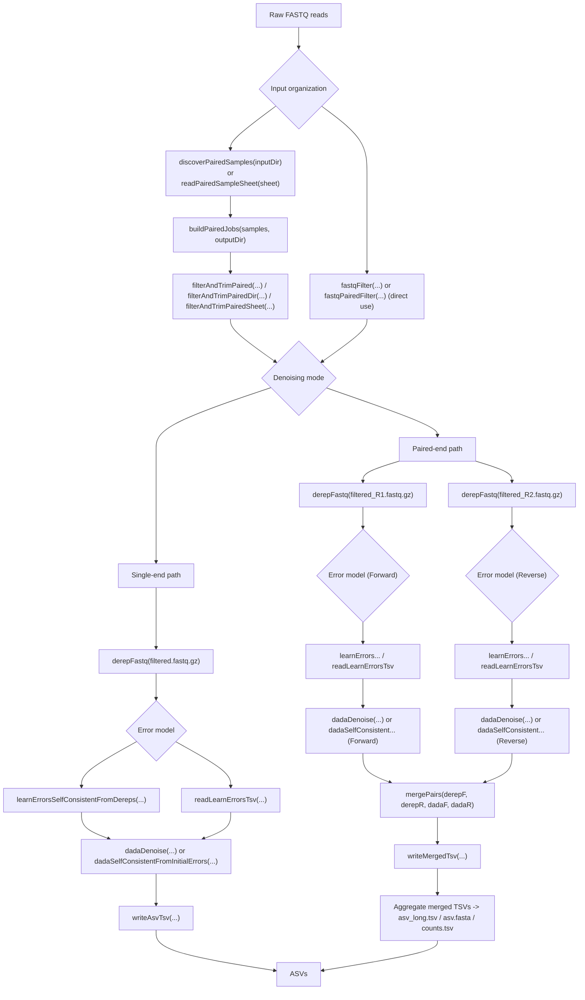

# Raw Reads To ASVs

```mermaid
flowchart TD
  A["Raw FASTQ reads"] --> B{"Input organization"}

  B --> B1["discoverPairedSamples(inputDir)\nor\nreadPairedSampleSheet(sheet)"]
  B1 --> B2["buildPairedJobs(samples, outputDir)"]
  B2 --> C["filterAndTrimPaired(...) / filterAndTrimPairedDir(...) / filterAndTrimPairedSheet(...)"]
  B --> C2["fastqFilter(...) or fastqPairedFilter(...) (direct use)"]

  C --> D{"Denoising mode"}
  C2 --> D

  D --> S1["Single-end path"]
  D --> P1["Paired-end path"]

  S1 --> S2["derepFastq(filtered.fastq.gz)"]
  S2 --> S3{"Error model"}
  S3 --> S4["learnErrorsSelfConsistentFromDereps(...)"]
  S3 --> S5["readLearnErrorsTsv(...)"]
  S4 --> S6["dadaDenoise(...) or dadaSelfConsistentFromInitialErrors(...)"]
  S5 --> S6
  S6 --> S7["writeAsvTsv(...)"]
  S7 --> Z["ASVs"]

  P1 --> P2["derepFastq(filtered_R1.fastq.gz)"]
  P1 --> P3["derepFastq(filtered_R2.fastq.gz)"]
  P2 --> P4{"Error model (Forward)"}
  P3 --> P5{"Error model (Reverse)"}
  P4 --> P6["learnErrors... / readLearnErrorsTsv"]
  P5 --> P7["learnErrors... / readLearnErrorsTsv"]
  P6 --> P8["dadaDenoise(...) or dadaSelfConsistent... (Forward)"]
  P7 --> P9["dadaDenoise(...) or dadaSelfConsistent... (Reverse)"]
  P8 --> P10["mergePairs(derepF, derepR, dadaF, dadaR)"]
  P9 --> P10
  P10 --> P11["writeMergedTsv(...)"]
  P11 --> P12["Aggregate merged TSVs -> asv_long.tsv / asv.fasta / counts.tsv"]
  P12 --> Z
```
